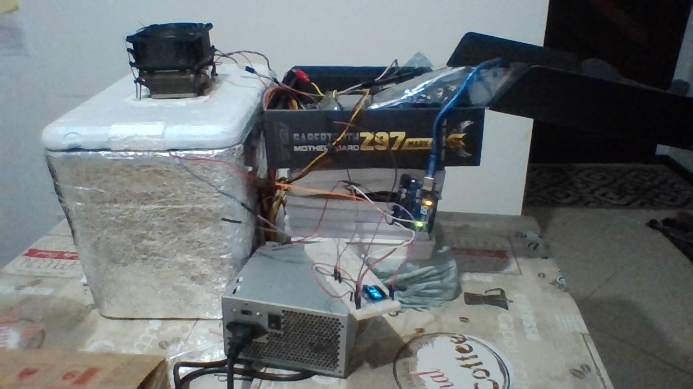
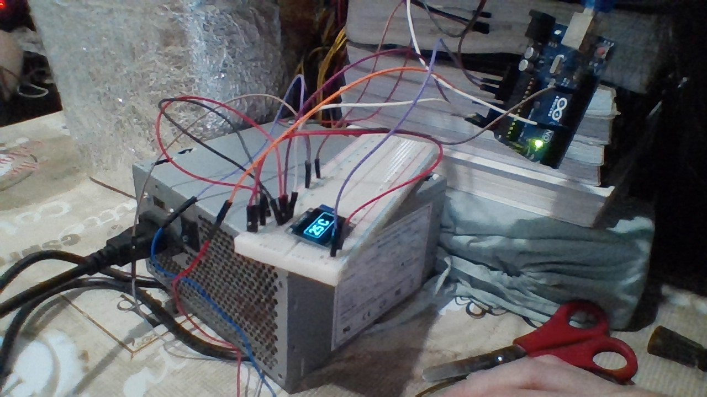
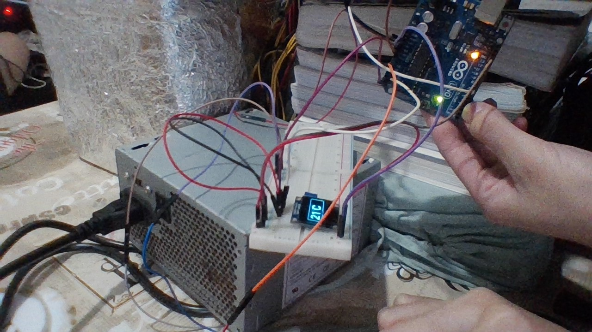

# Tabalho2
Projeto real de um refrigerador com pastilha peltier e sensor de temperatura.

O código se encontra no arquivo controler.c disponível neste repositório.

## Materiais

- Caixa de isopor 6L;
- 2 dissipadores;
- 1 pastilha peltier;
- Arduino uno;
- Relé AX1RC-5V;
- Display Oled;
- Sensor de temperatura - Módulo P10;
- 2 fans;
- 1 fonte ATX;
- 1 placa mãe;
- Cabos;

------------

## Detalhes do código

Utilizou-se a biblioteca `U8glib.h` para controlar o display e `Thermistor.h` para uso do sensor de temperatura.

O comando `Thermistor temp(0)` define o sensor de temperatura na porta analógia `A0`.

No procedimento `draw()` encontram-se os comandos para manipular o display. Basicamente, apresenta-se a temperatura centralizada na tela acompanhada do símbolo de grau (circulo superior) e de um `"C"` representando a unidade de medida. Para tanto, utiliza-se a função `sprintf()` para transformar o valor inteiro da temperatura em uma string e exibi-la com a função `drawStr()`.

No procedimento `setup()` configura-se as portas digitais `7` e `13` como `OUTPUT` (que tem como respectivas funções acionar a bobina do relé para energizar a pastilha peltier e sinalizar através de uma LED que o relé está funcionando). Também, no `setup()`, há a configuração do display e de um temporizador recorrente de 1 segundo sinalizando (com o uso da variável `flag`) que deve-se fazer a leitura do sensor térmico, de forma a estabilizar a leitura e economizar um pouco de energia no processo.

Por fim, o `loop()` usufrui da variável `flag` para definir quando deve-se fazer a leitura do sensor termico (atribuindo o valor à variável `temperature`), seguido pela estrutura de decisão a seguir: caso o valor seja menor que 20 graus envia-se `LOW` através da função `digitalWrite()` para as porta digitais `7` e `13` e, se não, se a temperatura for maior que 22 graus, envia-se `HIGH` pelo comando `digitalWrite()` às portas `7` e `13`. Tem-se este intervalo de 2 graus para que o relé não fique ligando e desligando próximo da temperatura de interesse (no caso, 20 graus), preservando sua vida útil. Depois, há um loop `while` com o objetivo de desenhar as saídas no display, linha a linha, analogamente ao funcionamento de uma impressora.

-------

## Imagens da construção real do projeto

#### O projeto pronto
 

#### Iníciando o sistema com a fonte ATX, mostrando 25 graus dentro da caixa de isopor
 

#### Após 15 min com o sistema ligado, teve uma queda de temperatura, mostrando 21 graus.
 

Obs: Imagens feita com câmera de notebook, relevar pois estão um pouco sem foco.

-----------

 ## Conclusão

A projeto funcionou muito bem: o relé ligou e desligou de forma eficiente e a troca de temperatura no display estava bem preciso para visualização. Pode-se escalar facilmente este projeto para prototipagens maiores utilizando o mesmo código.

 Contudo, infelizmente não houve uma grande queda de temperatura, o mínimo registrado foi de 19 graus após 3 horas.
 Portanto, ainda não é o ideal para um refrigerador. 

Para tanto, sugere-se algumas melhorias: 

 - Pode-se melhorar a vedação;
 - Aumantar a potência da ventuinha interna;
 - Fixar melhor o sensor de temperatura;
 - Utilizar uma quantidade maior de pastilhas peltier.